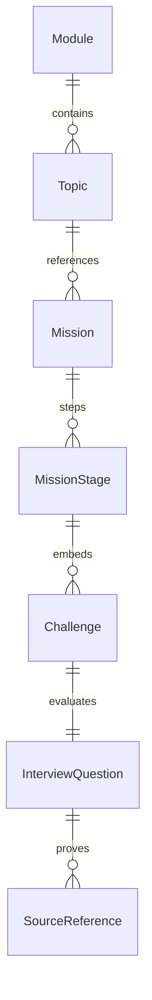

# DATA MODEL SPECIFICATION: LOCAL-FIRST ARCHITECTURE & DOMAIN ENTITY CONTRACTS

---

| Metadata | Details |
| :--- | :--- |
| **Document Status** | Approved / Authoritative Specification |
| **Document Version** | 1.0.0 |
| **Target Audience** | Principal Software Architects, Staff TypeScript Engineers, Data Architects, Knowledge Graph Engineers, Senior Java Engineers |
| **Authors** | Principal Software Architect, Staff TypeScript Engineer, Data Architect |
| **Primary Domain** | Local-First Schema Architecture, TypeScript Data Contracts, Knowledge Graph & Progress Persistence |
| **Effective Date** | July 2026 |

---

## EXECUTIVE SUMMARY & SPECIFICATION AUTHORITY

This document defines the formal data specification for the Senior Java Technical Interview Preparation Platform. It establishes the domain entity boundaries, TypeScript type contracts, graph schemas, state machines, IndexedDB table structures, and persistence workflows governing all curriculum content, user progress, mistake tracking, and knowledge representation.

### Rule of Precedence
This document is the binding single source of truth for all data structures, types, and persistence layer contracts. Any software implementation, database schema, state management store, or API contract that conflicts with this document **is invalid** unless explicitly overridden by an official document amendment.

---

## CORE HIERARCHY ALIGNMENT

The data model strictly implements the 7-tier core hierarchy specified in `PROJECT_VISION.md` and `LEARNING_ENGINE.md`:

```
┌────────────────────────────────────────────────────────────────────────────────────────┐
│                              SYSTEM HIERARCHY ARCHITECTURE                             │
└────────────────────────────────────────────────────────────────────────────────────────┘

  [ Tier 1: DASHBOARD ]         ──► Global aggregated analytics & readiness views
         │
         ▼
  [ Tier 2: MODULES GRID ]      ──► Top-level domain grid (e.g., OOP, Concurrency, JVM)
         │
         ▼
  [ Tier 3: MODULE ]            ──► Large learning domain containing topic clusters
         │
         ▼
  [ Tier 4: TOPIC ]             ──► Defined knowledge area & node in Knowledge Graph
         │
         ▼
  [ Tier 5: MISSION ]           ──► Problem-first learning experience attached to topics
         │
         ▼
  [ Tier 6: CHALLENGE ]         ──► Interactive coding, debugging, or puzzle task
         │
         ▼
  [ Tier 7: INTERVIEW ]         ──► Independent verbal explanation & follow-up stage
```

### Hierarchy Domain Boundaries:
* **Module (`Module`):** A major curriculum domain (e.g., Object-Oriented Programming, Concurrency).
* **Topic (`Topic`):** A distinct conceptual unit inside a module (e.g., Encapsulation, Method Overriding).
* **Mission (`Mission`):** An active, scenario-based learning expedition attached to one primary topic and optional secondary topics.
* **Challenge (`Challenge`):** An interactive exercise (coding, debugging, sequencing, trade-off evaluation) inside a mission stage.
* **Interview Stage (`MissionStage` with type `INTERVIEW_QUESTION` / `INTERVIEW_ANSWER`):** Evaluates candidate verbal delivery and follow-up reasoning.

---

## SECTION 1 — DATA MODEL PRINCIPLES

1. **Structured Content over Hardcoded Components:** All lessons, questions, and visualizer configurations are stored as structured JSON/TypeScript data models, never as hardcoded React component trees.
2. **Stable Globally Unique String IDs:** All entity identifiers use prefix-branded, UUIDv4 or K-Sortable alphanumeric string identifiers (e.g., `mod_oop_01`, `top_encap_02`, `mis_bank_acc_03`).
3. **Immutable Content vs. Mutable Progress:** Educational content data is strictly immutable at runtime. User progress, attempts, and mastery states are stored in isolated, mutable stores.
4. **Local-First Storage:** Primary persistence targets browser IndexedDB via Dexie.js. The app functions 100% offline without backend dependencies.
5. **Forward-Compatible Schema Evolution:** All persisted user entities contain a `schemaVersion: number` field to enable deterministic schema migrations.
6. **Bilingual Localization:** Human-readable prose is stored using `LocalizedText` (`{ en: string; ru: string }`). Java code, bytecode, and API identifiers remain untranslated.
7. **Explicit Source Provenance:** Interview questions must link to authenticated sources (`SourceReference`). Synthetic AI questions are strictly prohibited.
8. **No Isolated Questions:** Every question entity must be explicitly linked to at least one `Concept`, `Topic`, `CodeArtifact`, and `TheoryArticle`.
9. **Tag-Driven & Graph-Driven Navigation:** Navigation relies on explicit `KnowledgeEdge` graph links and indexed `Tag` entities.
10. **Discriminated Unions for Polymorphic Types:** Challenges, stages, and rich content blocks use explicit `type` discriminant keys. No `any` is permitted.
11. **No Ambiguous Booleans:** Complex states use explicit string enums (e.g., `VerificationStatus`, `ProvenanceClassification`) rather than boolean flags.
12. **Normalized Relationships:** Entities reference each other via string IDs rather than deeply nesting child objects, preventing data duplication.
13. **Derived Metrics Projections:** Aggregate metrics (e.g., module completion %, topic counts) are calculated via selectors or cached projections, not stored redundantly in source records.
14. **ISO 8601 Timestamps:** All dates use UTC ISO 8601 strings (e.g., `2026-07-31T13:21:12.000Z`).
15. **Explicit Order Fields:** Sequences of items (stages, options, hints) use explicit `order: number` fields.

---

## SECTION 2 — DOMAIN BOUNDARIES

The architecture isolates entities into 14 distinct functional domains with explicit unidirectional dependencies:

```
┌────────────────────────────────────────────────────────────────────────────────────────┐
│                                DOMAIN DEPENDENCY GRAPH                                 │
└────────────────────────────────────────────────────────────────────────────────────────┘

  [ 1. Curriculum Domain ] ──────┐
            │                     │
            ▼                     ▼
  [ 2. Learning Content ] ──► [ 4. Knowledge Graph ] ──► [ 5. Source Provenance ]
            │                     │
            ▼                     ▼
  [ 3. Challenge Domain ] ────────┼─────────────────────────┐
            │                     │                         │
            ▼                     ▼                         ▼
  [ 6. User Progress ] ──► [ 7. Attempts & Eval ] ──► [ 8. Mistake Analysis ]
            │                     │                         │
            ▼                     ▼                         ▼
  [ 9. Mastery Domain ] ──► [ 10. Spaced Repetition] ──► [ 11. Gamification ]
            │                     │                         │
            ▼                     ▼                         ▼
  [ 12. User Prefs ]   ──► [ 13. Import / Export ] ──► [ 14. Analytics ]
```

### Domain Rules:
* **Curriculum & Content Domains** have zero dependencies on User data domains.
* **User Progress & Attempts** depend on Curriculum/Challenge IDs.
* **Circular domain dependencies are strictly forbidden.**

---

## SECTION 3 — LOCALIZATION & RICH TEXT MODEL

### 3.1 Primitive Types & Language Contracts

```ts
export type LanguageCode = "en" | "ru";
export type LanguageMode = "en" | "ru" | "bilingual";

export interface LocalizedText {
  readonly en: string;
  readonly ru: string;
}

export interface OptionalLocalizedText {
  readonly en?: string;
  readonly ru?: string;
}
```

### 3.2 Structured Rich Content Model
Content prose is stored as structured block nodes, preventing raw HTML injection and enabling multi-platform rendering:

```ts
export type RichBlockType =
  | "PARAGRAPH"
  | "HEADING"
  | "BULLET_LIST"
  | "NUMBERED_LIST"
  | "CALLOUT"
  | "WARNING"
  | "TABLE"
  | "DIAGRAM_REF"
  | "CODE_REF";

export interface BaseRichBlock {
  readonly id: string;
  readonly type: RichBlockType;
}

export interface ParagraphBlock extends BaseRichBlock {
  readonly type: "PARAGRAPH";
  readonly content: LocalizedText;
}

export interface HeadingBlock extends BaseRichBlock {
  readonly type: "HEADING";
  readonly level: 1 | 2 | 3 | 4;
  readonly text: LocalizedText;
}

export interface CalloutBlock extends BaseRichBlock {
  readonly type: "CALLOUT" | "WARNING";
  readonly title?: LocalizedText;
  readonly content: LocalizedText;
}

export interface CodeRefBlock extends BaseRichBlock {
  readonly type: "CODE_REF";
  readonly codeArtifactId: string;
  readonly displayMode: "CLEAN" | "ANNOTATED";
}

export interface DiagramRefBlock extends BaseRichBlock {
  readonly type: "DIAGRAM_REF";
  readonly visualizationId: string;
}

export type RichContentBlock =
  | ParagraphBlock
  | HeadingBlock
  | CalloutBlock
  | CodeRefBlock
  | DiagramRefBlock;
```

---

## SECTION 4 — CURRICULUM ENTITIES

### 4.1 Module Entity

```ts
export type DifficultyTier = "FOUNDATION" | "APPLIED" | "SENIOR" | "STAFF";

export interface Module {
  readonly id: string; // e.g., "mod_oop"
  readonly slug: string; // e.g., "object-oriented-programming"
  readonly title: LocalizedText;
  readonly shortTitle: LocalizedText;
  readonly description: LocalizedText;
  readonly icon: string;
  readonly difficultyRange: {
    readonly min: DifficultyTier;
    readonly max: DifficultyTier;
  };
  readonly estimatedMinutes: number;
  readonly topicIds: readonly string[];
  readonly tags: readonly string[];
  readonly order: number;
  readonly availability: "AVAILABLE" | "BETA" | "COMING_SOON";
  readonly version: string;
  readonly createdAt: string;
  readonly updatedAt: string;
}
```

### 4.2 Topic Entity

```ts
export interface Topic {
  readonly id: string; // e.g., "top_encapsulation"
  readonly moduleId: string;
  readonly slug: string;
  readonly title: LocalizedText;
  readonly description: LocalizedText;
  readonly learningObjectives: readonly LocalizedText[];
  readonly prerequisiteTopicIds: readonly string[];
  readonly relatedTopicIds: readonly string[];
  readonly missionIds: readonly string[];
  readonly canonicalTags: readonly string[];
  readonly estimatedMinutes: number;
  readonly difficulty: DifficultyTier;
  readonly order: number;
  readonly sourceIds: readonly string[];
}
```

### 4.3 Mission Entity

```ts
export interface Mission {
  readonly id: string; // e.g., "mis_bank_account_invariants"
  readonly primaryTopicId: string;
  readonly secondaryTopicIds: readonly string[];
  readonly slug: string;
  readonly title: LocalizedText;
  readonly description: LocalizedText;
  readonly scenarioIntroduction: LocalizedText;
  readonly engineeringProblem: LocalizedText;
  readonly learningObjectives: readonly LocalizedText[];
  readonly requiredConceptIds: readonly string[];
  readonly recommendedConceptIds: readonly string[];
  readonly stageIds: readonly string[];
  readonly challengeIds: readonly string[];
  readonly estimatedMinutes: number;
  readonly difficulty: DifficultyTier;
  readonly xpReward: number;
  readonly version: string;
}
```

### 4.4 MissionStage Discriminated Union

```ts
export type MissionStageType =
  | "MISSION_INTRODUCTION"
  | "REAL_ENGINEERING_PROBLEM"
  | "THINK_YOURSELF"
  | "NEED_HELP"
  | "THEORY"
  | "VISUALIZATION"
  | "INTERACTIVE_PRACTICE"
  | "INTERVIEW_QUESTION"
  | "INTERVIEW_ANSWER"
  | "DEBUG_COUNTER_EXAMPLE"
  | "RELATED_TOPICS"
  | "MISSION_RESULTS"
  | "REFLECTION";

export interface BaseMissionStage {
  readonly id: string;
  readonly missionId: string;
  readonly type: MissionStageType;
  readonly order: number;
  readonly title: LocalizedText;
  readonly instructions?: LocalizedText;
}

export interface TheoryStage extends BaseMissionStage {
  readonly type: "THEORY";
  readonly theoryArticleId: string;
}

export interface PracticeStage extends BaseMissionStage {
  readonly type: "INTERACTIVE_PRACTICE" | "DEBUG_COUNTER_EXAMPLE";
  readonly challengeId: string;
}

export interface InterviewStage extends BaseMissionStage {
  readonly type: "INTERVIEW_QUESTION" | "INTERVIEW_ANSWER";
  readonly interviewQuestionId: string;
  readonly challengeId: string;
}

export type MissionStage = BaseMissionStage | TheoryStage | PracticeStage | InterviewStage;
```

---

## SECTION 5 — OOP MODULE SEED TAXONOMY

The initial Object-Oriented Programming module includes 37 canonical topics organized in a non-linear prerequisite graph:

| Topic ID | Title | Difficulty | Prerequisite Topic IDs |
| :--- | :--- | :--- | :--- |
| `top_oop_01` | Introduction to OOP | FOUNDATION | `[]` |
| `top_oop_02` | Classes and Objects | FOUNDATION | `["top_oop_01"]` |
| `top_oop_03` | State, Behavior, and Identity | FOUNDATION | `["top_oop_02"]` |
| `top_oop_04` | Constructors & Initialization | APPLIED | `["top_oop_03"]` |
| `top_oop_05` | Encapsulation & Info Hiding | APPLIED | `["top_oop_03"]` |
| `top_oop_06` | Access Modifiers | APPLIED | `["top_oop_05"]` |
| `top_oop_07` | Abstraction | APPLIED | `["top_oop_05"]` |
| `top_oop_08` | Abstract Classes | APPLIED | `["top_oop_07"]` |
| `top_oop_09` | Interfaces | APPLIED | `["top_oop_07"]` |
| `top_oop_10` | Inheritance | APPLIED | `["top_oop_02"]` |
| `top_oop_11` | Polymorphism | SENIOR | `["top_oop_09", "top_oop_10"]` |
| `top_oop_12` | Dynamic Dispatch | SENIOR | `["top_oop_11"]` |
| `top_oop_13` | Upcasting and Downcasting | APPLIED | `["top_oop_11"]` |
| `top_oop_14` | Method Overloading | APPLIED | `["top_oop_02"]` |
| `top_oop_15` | Method Overriding | APPLIED | `["top_oop_10"]` |
| `top_oop_16` | Composition vs Inheritance | SENIOR | `["top_oop_10"]` |
| `top_oop_17` | Association & Aggregation | APPLIED | `["top_oop_16"]` |
| `top_oop_18` | Coupling and Cohesion | SENIOR | `["top_oop_05", "top_oop_16"]` |
| `top_oop_19` | Object Class & Contracts | APPLIED | `["top_oop_02"]` |
| `top_oop_20` | equals() and hashCode() | SENIOR | `["top_oop_19"]` |
| `top_oop_21` | toString() & Formatting | FOUNDATION | `["top_oop_19"]` |
| `top_oop_22` | Immutability & Defensive Copy | SENIOR | `["top_oop_05"]` |
| `top_oop_23` | SOLID Principles Overview | SENIOR | `["top_oop_09", "top_oop_16"]` |
| `top_oop_24` | Dependency Injection | SENIOR | `["top_oop_09", "top_oop_23"]` |
| `top_oop_25` | Object Creation Patterns | SENIOR | `["top_oop_04", "top_oop_09"]` |
| `top_oop_26` | Strategy Pattern | SENIOR | `["top_oop_11"]` |
| `top_oop_27` | Factory Pattern | SENIOR | `["top_oop_25"]` |
| `top_oop_28` | Builder Pattern | SENIOR | `["top_oop_22", "top_oop_25"]` |
| `top_oop_29` | Template Method Pattern | SENIOR | `["top_oop_08"]` |
| `top_oop_30` | Observer Pattern | SENIOR | `["top_oop_09"]` |
| `top_oop_31` | Decorator Pattern | SENIOR | `["top_oop_09", "top_oop_16"]` |
| `top_oop_32` | Common OOP Anti-Patterns | SENIOR | `["top_oop_18"]` |
| `top_oop_33` | Domain Modeling | SENIOR | `["top_oop_18"]` |
| `top_oop_34` | API Contract Design | SENIOR | `["top_oop_09", "top_oop_22"]` |
| `top_oop_35` | Refactoring Legacy OOP | STAFF | `["top_oop_32"]` |
| `top_oop_36` | Senior OOP Interview Trade-offs | STAFF | `["top_oop_23", "top_oop_34"]` |
| `top_oop_37` | JVM Memory & Object Layout | STAFF | `["top_oop_03", "top_oop_20"]` |

---

## SECTION 6 — THEORY & KNOWLEDGE CONTENT

```ts
export interface TheoryArticle {
  readonly id: string;
  readonly topicIds: readonly string[];
  readonly conceptIds: readonly string[];
  readonly title: LocalizedText;
  readonly summary: LocalizedText;
  readonly sections: readonly TheorySection[];
  readonly prerequisiteConceptIds: readonly string[];
  readonly sourceIds: readonly string[];
  readonly verificationStatus: VerificationStatus;
  readonly tags: readonly string[];
  readonly estimatedMinutes: number;
  readonly version: string;
}

export interface TheorySection {
  readonly id: string;
  readonly category:
    | "DEFINITION"
    | "MOTIVATION"
    | "MENTAL_MODEL"
    | "MECHANICS"
    | "TRADE_OFFS"
    | "PRODUCTION_USE"
    | "COMMON_MISTAKES"
    | "INTERVIEW_GUIDANCE";
  readonly title: LocalizedText;
  readonly blocks: readonly RichContentBlock[];
}

export interface Visualization {
  readonly id: string;
  readonly type: "STATIC_DIAGRAM" | "INTERACTIVE_MEMORY_MAP" | "SEQUENCE_FLOW" | "STATE_TRANSITION";
  readonly title: LocalizedText;
  readonly configJson: string; // Serialized visualization state schema
}
```

---

## SECTION 7 — INTERVIEW QUESTION MODEL

```ts
export type ProvenanceClassification =
  | "REAL_INTERVIEW_REPORT"
  | "REPEATED_INTERVIEW_PATTERN"
  | "CURATED_INTERVIEW_BANK"
  | "OFFICIAL_LANGUAGE_EDGE_CASE"
  | "BOOK_DERIVED_EXERCISE"
  | "GENERATED_PRACTICE_VARIATION";

export type VerificationStatus =
  | "UNVERIFIED"
  | "SOURCE_CONFIRMED"
  | "TECHNICALLY_VERIFIED"
  | "MULTI_SOURCE_CONFIRMED"
  | "REJECTED";

export interface InterviewQuestion {
  readonly id: string;
  readonly slug: string;
  readonly questionText: LocalizedText;
  readonly context?: LocalizedText;
  readonly primaryTopicId: string;
  readonly relatedTopicIds: readonly string[];
  readonly requiredConceptIds: readonly string[];
  readonly tags: readonly string[];
  readonly careerDifficulty: DifficultyTier;
  readonly expectedAnswerOutline: LocalizedText;
  readonly expectedConcepts: readonly string[];
  readonly commonWeaknessPatterns: readonly LocalizedText[];
  readonly likelyFollowUpQuestionIds: readonly string[];
  readonly codeArtifactIds: readonly string[];
  readonly sourceReferences: readonly SourceReference[];
  readonly provenanceClassification: ProvenanceClassification;
  readonly verificationState: VerificationStatus;
  readonly companyContext?: {
    readonly companyName: string;
    readonly reportedRoles: readonly string[];
    readonly verified: boolean;
  };
  readonly version: string;
}
```

> **Invariant:** An entity with `provenanceClassification === "GENERATED_PRACTICE_VARIATION"` MUST NEVER have `verificationState === "SOURCE_CONFIRMED"` or display enterprise company badges.

---

## SECTION 8 — SOURCE PROVENANCE MODEL

```ts
export type ReliabilityLevel = "HIGH" | "MEDIUM" | "LOW" | "UNVERIFIED";

export interface Source {
  readonly id: string;
  readonly platform:
    | "Glassdoor"
    | "interviewing.io"
    | "LeetCode_Discuss"
    | "Reddit"
    | "Baeldung"
    | "Oracle_Java_Docs"
    | "JLS"
    | "JVMS"
    | "OpenJDK"
    | "Book";
  readonly title: string;
  readonly url?: string;
  readonly company?: string;
  readonly reliability: ReliabilityLevel;
  readonly accessedDate: string;
}

export interface SourceReference {
  readonly sourceId: string;
  readonly relationshipType: "DIRECT_REPORT" | "SPECIFICATION_AUTHORITY" | "ADAPTED_PATTERN";
  readonly directQuotationUsed: boolean;
  readonly notes?: string;
}
```

---

## SECTION 9 — CODE ARTIFACT MODEL

```ts
export type CodeType =
  | "QUESTION_CODE"
  | "ANNOTATED_CODE"
  | "CORRECT_SOLUTION"
  | "COUNTER_EXAMPLE"
  | "SUPPLEMENTARY_EXAMPLE"
  | "FOLLOW_UP_CODE";

export type AnnotationCategory =
  | "WHY_IT_EXISTS"
  | "PROBLEM_IN_ORIGINAL_CODE"
  | "HOW_IT_FIXES_THE_PROBLEM"
  | "INTERVIEW_CONCEPT"
  | "TRADE_OFF"
  | "PRODUCTION_RISK"
  | "COMMON_MISTAKE";

export interface CodeAnnotation {
  readonly id: string;
  readonly startLine: number;
  readonly endLine: number;
  readonly category: AnnotationCategory;
  readonly title: LocalizedText;
  readonly explanation: LocalizedText;
  readonly problemSolved?: LocalizedText;
  readonly conceptDemonstrated?: string;
}

export interface CodeArtifact {
  readonly id: string;
  readonly type: CodeType;
  readonly language: "java";
  readonly javaVersion: "17" | "21";
  readonly title: LocalizedText;
  readonly sourceCode: string;
  readonly annotations: readonly CodeAnnotation[];
  readonly relatedQuestionIds: readonly string[];
  readonly conceptIds: readonly string[];
  readonly tags: readonly string[];
}
```

---

## SECTION 10 — CHALLENGE MODEL & PUZZLE ENGINE

```ts
export type AssistanceLevel = "GUIDED" | "APPLIED" | "INTERVIEW";

export type ChallengeType =
  | "SEQUENCE_PUZZLE"
  | "CAUSE_EFFECT_PUZZLE"
  | "MATCHING_PUZZLE"
  | "MULTIPLE_CHOICE"
  | "MULTI_SELECT"
  | "BUG_HUNT"
  | "FIX_BUILDER"
  | "CODE_READING"
  | "OUTPUT_PREDICTION"
  | "TRADE_OFF_CHALLENGE"
  | "SHORT_ANSWER"
  | "INTERVIEW_ANSWER"
  | "REFLECTION_PROMPT";

export interface BaseChallenge {
  readonly id: string;
  readonly type: ChallengeType;
  readonly missionId: string;
  readonly stageId: string;
  readonly title: LocalizedText;
  readonly prompt: LocalizedText;
  readonly difficulty: DifficultyTier;
  readonly assistanceLevel: AssistanceLevel;
  readonly conceptIds: readonly string[];
  readonly topicIds: readonly string[];
  readonly tags: readonly string[];
  readonly sourceQuestionId?: string;
  readonly hintIds: readonly string[];
  readonly xpReward: number;
  readonly order: number;
}

export interface SequencePuzzleChallenge extends BaseChallenge {
  readonly type: "SEQUENCE_PUZZLE";
  readonly payload: {
    readonly items: readonly { readonly id: string; readonly text: LocalizedText }[];
    readonly correctOrderIds: readonly string[];
  };
}

export interface FixBuilderChallenge extends BaseChallenge {
  readonly type: "FIX_BUILDER";
  readonly payload: {
    readonly baseCodeArtifactId: string;
    readonly solutionCodeArtifactId: string;
    readonly allowedInsertions: readonly string[];
  };
}

export interface InterviewAnswerChallenge extends BaseChallenge {
  readonly type: "INTERVIEW_ANSWER";
  readonly payload: {
    readonly targetQuestionId: string;
    readonly rubricDimensions: readonly string[];
  };
}

export type Challenge = SequencePuzzleChallenge | FixBuilderChallenge | InterviewAnswerChallenge | BaseChallenge;
```

---

## SECTION 11 — HINT MODEL

```ts
export interface Hint {
  readonly id: string;
  readonly challengeId: string;
  readonly level: 1 | 2 | 3 | 4; // 1: Directional, 2: Concept, 3: Mechanism, 4: Near-Solution
  readonly text: LocalizedText;
  readonly xpPenalty: number;
  readonly order: number;
}
```

---

## SECTION 12 — ANSWER & EVALUATION MODEL

```ts
export type ConfidenceLevel = "CONFIDENT" | "UNSURE" | "GUESSING";

export interface UserAttempt {
  readonly id: string;
  readonly userId: string;
  readonly challengeId: string;
  readonly missionId: string;
  readonly answerPayloadJson: string;
  readonly submittedAt: string;
  readonly durationMs: number;
  readonly confidence: ConfidenceLevel;
  readonly hintsUsedIds: readonly string[];
  readonly evaluation: EvaluationResult;
  readonly xpAwarded: number;
}

export interface EvaluationResult {
  readonly correctness: "CORRECT" | "PARTIALLY_CORRECT" | "INCORRECT";
  readonly score: number; // 0.0 - 1.0
  readonly feedback: LocalizedText;
  readonly matchedConceptIds: readonly string[];
  readonly missingConceptIds: readonly string[];
  readonly detectedMistakePatternIds: readonly string[];
}
```

---

## SECTION 13 — MISTAKE ENGINE

```ts
export interface MistakePattern {
  readonly id: string;
  readonly code: string; // e.g., "ERR_MUTABLE_HASHCODE_KEY"
  readonly title: LocalizedText;
  readonly description: LocalizedText;
  readonly conceptIds: readonly string[];
  readonly exampleIncorrectReasoning: LocalizedText;
  readonly correctedReasoning: LocalizedText;
  readonly remediationMissionIds: readonly string[];
}

export interface UserMistakeRecord {
  readonly id: string;
  readonly userId: string;
  readonly mistakePatternId: string;
  readonly occurrenceCount: number;
  readonly confidentMistakeCount: number;
  readonly lastSeenAt: string;
  readonly resolved: boolean;
}
```

> **Cognitive Rationale:** A confident incorrect answer receives 2x weight in scheduling remediation reviews compared to a guessed wrong answer, as it represents an active mental model misconception rather than simple absence of knowledge.

---

## SECTION 14 — KNOWLEDGE GRAPH MODEL

```ts
export type EdgeType =
  | "REQUIRES"
  | "RELATED_TO"
  | "CONTRASTS_WITH"
  | "APPLIES_TO"
  | "EXPLAINS"
  | "TESTED_BY"
  | "DEMONSTRATED_BY"
  | "FIXES"
  | "CAUSES"
  | "DEEPER_THAN";

export interface Concept {
  readonly id: string; // e.g., "cpt_encapsulation"
  readonly slug: string;
  readonly title: LocalizedText;
  readonly summary: LocalizedText;
  readonly topicIds: readonly string[];
  readonly canonicalTag: string;
  readonly prerequisiteConceptIds: readonly string[];
}

export interface KnowledgeEdge {
  readonly id: string;
  readonly sourceNodeId: string;
  readonly targetNodeId: string;
  readonly edgeType: EdgeType;
  readonly weight: number; // 0.0 to 1.0
}
```

---

## SECTION 15 — TAG MODEL

```ts
export interface Tag {
  readonly id: string; // e.g., "tag_encapsulation"
  readonly slug: string;
  readonly displayName: LocalizedText;
  readonly canonicalConceptId?: string;
  readonly category: "LANGUAGE_FEATURE" | "OOP" | "CONCURRENCY" | "JVM" | "ARCHITECTURE";
}
```

---

## SECTION 16 — USER PROGRESS MODEL

```ts
export type MissionState = "NOT_STARTED" | "LEARNING" | "PRACTICING" | "INTERVIEW_READY" | "MASTERED";

export interface MissionProgress {
  readonly userId: string;
  readonly missionId: string;
  readonly state: MissionState;
  readonly currentStageId: string;
  readonly completedStageIds: readonly string[];
  readonly startedAt: string;
  readonly lastActivityAt: string;
  readonly completedAt?: string;
  readonly masteredAt?: string;
  readonly completionPercentage: number;
  readonly bestScore: number;
  readonly totalAttempts: number;
}
```

---

## SECTION 17 — MASTERY MODEL

```ts
export type MasteryState = "UNSEEN" | "EXPOSED" | "DEVELOPING" | "RELIABLE" | "INTERVIEW_READY" | "MASTERED";

export interface ConceptMastery {
  readonly userId: string;
  readonly conceptId: string;
  readonly score: number; // 0 to 100
  readonly independentCorrectAttempts: number;
  readonly confidentIncorrectAttempts: number;
  readonly lastPracticedAt: string;
  readonly nextReviewDueAt: string;
  readonly state: MasteryState;
}
```

---

## SECTION 18 — SPACED REPETITION MODEL

```ts
export interface ReviewItem {
  readonly id: string;
  readonly userId: string;
  readonly conceptId: string;
  readonly dueAt: string;
  readonly intervalDays: number;
  readonly reviewReason: "INCORRECT_ANSWER" | "CONFIDENT_MISTAKE" | "SCHEDULED_RETENTION";
  readonly attemptsCount: number;
}
```

---

## SECTION 19 — GAMIFICATION MODEL

```ts
export interface XPTransaction {
  readonly id: string;
  readonly userId: string;
  readonly amount: number;
  readonly reason: "CORRECT_NO_HINTS" | "MISSION_COMPLETE" | "REVIEW_COMPLETE";
  readonly createdAt: string;
}

export interface Achievement {
  readonly id: string;
  readonly title: LocalizedText;
  readonly description: LocalizedText;
  readonly icon: string;
  readonly xpReward: number;
}
```

---

## SECTION 20 — REFLECTION MODEL

```ts
export interface ReflectionNote {
  readonly id: string;
  readonly userId: string;
  readonly missionId: string;
  readonly responseText: string;
  readonly createdAt: string;
}
```

---

## SECTION 21 — USER PREFERENCES

```ts
export interface UserPreferences {
  readonly userId: string;
  readonly languageMode: LanguageMode;
  readonly reducedMotion: boolean;
  readonly codeCommentsMode: "CLEAN" | "ANNOTATED";
  readonly theme: "DARK_GLASS";
  readonly schemaVersion: number;
}
```

---

## SECTION 22 — ACTIVITY & ANALYTICS

```ts
export interface ActivityEvent {
  readonly id: string;
  readonly userId: string;
  readonly eventType: "MISSION_START" | "STAGE_COMPLETE" | "ATTEMPT_SUBMIT";
  readonly timestamp: string;
}
```

---

## SECTION 23 — INTERVIEW READINESS MODEL

```ts
export interface InterviewReadinessSnapshot {
  readonly id: string;
  readonly userId: string;
  readonly overallScore: number; // 0 - 100
  readonly knowledgeScore: number;
  readonly applicationScore: number;
  readonly calculatedAt: string;
}
```

---

## SECTION 24 — CONTENT VERSIONING

```ts
export interface ContentSchemaMetadata {
  readonly contentVersion: string;
  readonly schemaVersion: number;
  readonly publishedAt: string;
}
```

---

## SECTION 25 — INDEXEDDB & DEXIE STORAGE SPECIFICATION

```ts
// Dexie Database Schema Declaration
export const DEXIE_TABLE_SCHEMA = {
  modules: "id, slug, order",
  topics: "id, moduleId, slug, order",
  missions: "id, primaryTopicId, slug",
  missionStages: "id, missionId, order",
  concepts: "id, slug, canonicalTag",
  knowledgeEdges: "id, sourceNodeId, targetNodeId, edgeType",
  theoryArticles: "id, version",
  interviewQuestions: "id, primaryTopicId, verificationState",
  codeArtifacts: "id, type",
  challenges: "id, missionId, stageId",
  userAttempts: "id, userId, challengeId, missionId, submittedAt",
  missionProgress: "[userId+missionId], state, lastActivityAt",
  conceptMastery: "[userId+conceptId], state, nextReviewDueAt",
  userMistakes: "id, [userId+mistakePatternId], resolved",
  reviewItems: "id, [userId+conceptId], dueAt",
  xpTransactions: "id, userId, createdAt",
  userPreferences: "userId"
};
```

---

## SECTION 26 — IMPORT & EXPORT

```ts
export interface ProgressExport {
  readonly exportFormatVersion: "1.0";
  readonly exportedAt: string;
  readonly preferences: UserPreferences;
  readonly missionProgress: readonly MissionProgress[];
  readonly conceptMastery: readonly ConceptMastery[];
  readonly attempts: readonly UserAttempt[];
}
```

---

## SECTION 27 — FUTURE CLOUD SYNCHRONIZATION READINESS

All user progress records contain `userId: string`, `createdAt: string`, `updatedAt: string`, and `schemaVersion: number`, enabling seamless future synchronization to PostgreSQL / Supabase backend endpoints via optimistic concurrency control.

---

## SECTION 28 — TYPE DEFINITIONS

All types are exported as strict, immutable TypeScript interfaces using `readonly` modifiers. Zero `any` types are permitted across the codebase.

---

## SECTION 29 — RELATIONSHIP DIAGRAMS



---

## SECTION 30 — INVARIANTS & VALIDATION RULES

1. Every Mission MUST belong to at least one primary Topic.
2. Every verified InterviewQuestion MUST contain at least one valid `SourceReference`.
3. Generated practice variations MUST NEVER display enterprise company context.
4. User attempt updates MUST execute atomically in an IndexedDB transaction.

---

## SECTION 31 — EXAMPLE OBJECT GRAPH (ENCAPSULATION BANKACCOUNT MISSION)

```json
{
  "module": { "id": "mod_oop", "slug": "object-oriented-programming" },
  "topic": { "id": "top_oop_05", "title": { "en": "Encapsulation & Information Hiding", "ru": "Инкапсуляция и сокрытие информации" } },
  "concept": { "id": "cpt_encapsulation", "canonicalTag": "#encapsulation" },
  "mission": { "id": "mis_bank_account_invariants", "primaryTopicId": "top_oop_05" },
  "question": {
    "id": "q_bank_encap_01",
    "provenanceClassification": "REAL_INTERVIEW_REPORT",
    "verificationState": "SOURCE_CONFIRMED"
  }
}
```

---

## SECTION 32 — IMPLEMENTATION GUIDANCE

* **Type Placement:** Place types in `src/types/domain/`.
* **Dexie Setup:** Define database stores inside `src/services/db/appDatabase.ts`.
* **Zustand Slices:** Separate UI state from IndexedDB persistent data using dedicated query selectors.

---

```
[ END OF DATA MODEL SPECIFICATION DOCUMENT ]
```
